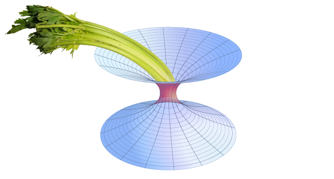

# GWCelery

GWCelery is a simple and reliable package for annotating and orchestrating LIGO/Virgo alerts, built from widely used open source components.

See the [quick start instructions for installation](https://emfollow.docs.ligo.org/gwcelery/quickstart.html)
and the [documentation](https://emfollow.docs.ligo.org/gwcelery/) for more
details.

## Features

 - [Easy installation with `pip`](https://emfollow.docs.ligo.org/gwcelery/quickstart.html)
 - Lightning fast distributed task queue powered by
   [Celery](http://celeryproject.org) and Redis (https://redis.io)
 - Tasks are defined by [small, self-contained Python functions](https://git.ligo.org/emfollow/gwcelery/tree/master/gwcelery/tasks)
 - [Lightweight test suite](https://git.ligo.org/emfollow/gwcelery/tree/master/gwcelery/tests) using mocks of external services
 - [Continuous integration](https://git.ligo.org/emfollow/gwcelery/pipelines)
 - [One line of code to switch from test to production GraceDB server](https://git.ligo.org/emfollow/gwcelery/blob/master/gwcelery/celery.py)
 - [Browser-based monitoring console](https://emfollow.docs.ligo.org/gwcelery/monitoring.html)
